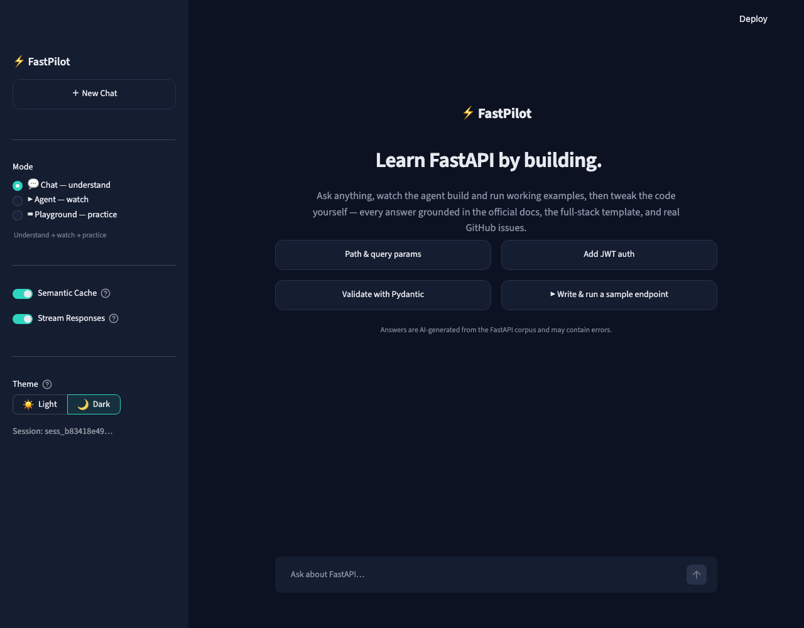
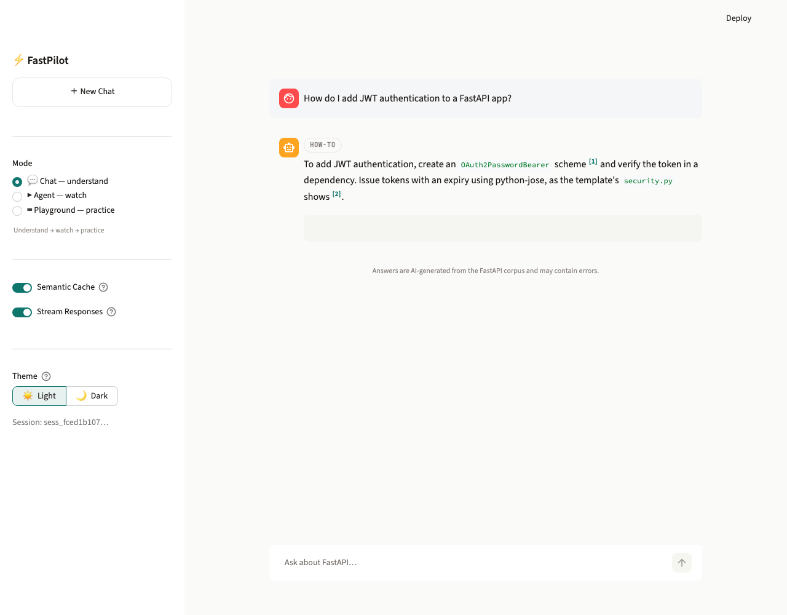
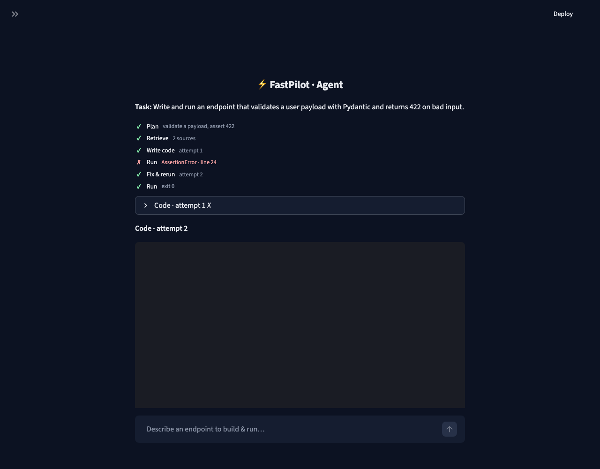
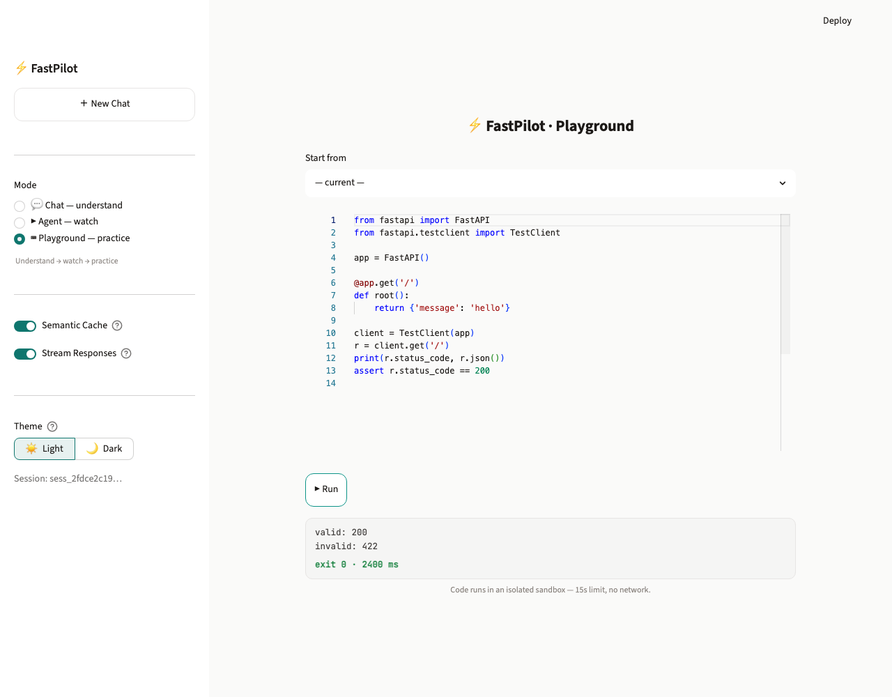

<div align="center">

# ⚡ FastPilot

### *Learn FastAPI, fast.*

A production **RAG** system that closes the loop from reading to running:
**Understand → Watch → Practice.**

[](https://github.com/sunkanmi-olawuwo/fastpilot/actions/workflows/ci.yml)


**[▶ Live demo](https://frontend-production-3afb.up.railway.app/)** · **[Video walkthrough](https://www.loom.com/share/a1d6bf3ee7c54e5c93de4ac8c280992f)** · **[Docs & architecture](https://github.com/sunkanmi-olawuwo/fastpilot/wiki)**



</div>

> **Live** on Railway — try the [demo](https://frontend-production-3afb.up.railway.app/) (it may take a few
> seconds to wake from idle). The screenshots below are real renders of the UI.

---

## The problem

Learning FastAPI is **fragmented and unverified**. The knowledge lives in three disconnected places —
the [official docs](https://fastapi.tiangolo.com/), example repos like the full-stack template, and
GitHub issues/discussions — and **reading doesn't prove you understood it**: you can read the
path-parameter docs and still ship an endpoint that 500s. The only way to *verify* understanding is to
run code, which means leaving the docs and debugging alone.

**FastPilot closes that loop** with three modes that form a learning cycle:

| Mode | Verb | What it does |
|---|---|---|
| 💬 **Chat** | *understand* | Cited answers grounded in the FastAPI corpus — every claim carries a `[n]` source. |
| ▶️ **Agent** | *watch* | Writes, runs, and **self-corrects** real code in a sandbox — you watch it debug. |
| 🧪 **Playground** | *practice* | Edit the agent's code and re-run it yourself in the same sandbox. |

<table>
<tr>
<td width="33%"><br><sub><b>Chat</b> — grounded answer with a <code>[1]</code> citation</sub></td>
<td width="33%"><br><sub><b>Agent</b> — Run → AssertionError → Fix & rerun → exit 0</sub></td>
<td width="33%"><br><sub><b>Playground</b> — edit & run in the isolated sandbox</sub></td>
</tr>
</table>

---

## Architecture

```
Streamlit frontend ──HTTP/SSE──> FastAPI backend ──> Qdrant Cloud (hybrid retrieval)
                                          │            Voyage (embed + rerank-2.5)
                                          │            Gemini 2.5 Flash (generate)
                                          ├──> Redis Cloud (conversation memory + semantic cache)
                                          └──> Opik (tracing, prompt versioning, feedback)
```

The backend ships SSE token streaming, a semantic cache, conversation memory with conditional
query-rewrite, a query router, deterministic security guards, and graceful degradation when Redis or
Qdrant is unavailable. The agent runs generated code through a hardened in-process sandbox (AST
denylist, env scrubbed, network off). Every production service is an explicit **add / skip decision**,
documented in [`docs/production-decisions.md`](docs/production-decisions.md).

**Tech:** FastAPI · Streamlit · Qdrant Cloud · Voyage AI (voyage-4-lite + rerank-2.5) · Gemini 2.5
Flash · Redis Cloud (RediSearch) · Opik/Comet · Docker · Railway · `uv`.

---

## What makes it more than a chatbot

Each decision is **evidence-backed**, not a default — full reasoning in the linked docs:

- **Chunking** — hybrid chunker: **AST (tree-sitter)** for code, markdown-aware recursive for prose,
  routed by language so a code chunk is never split mid-function. Migrating **BGE → Voyage-4-lite
  (2048-d)** eliminated **27.9% silent chunk truncation**. → [`docs/chunking-strategy.md`](docs/chunking-strategy.md)
- **Retrieval (T1b)** — hybrid **dense + BM25 → RRF → Voyage rerank-2.5 → top 10**. T1b won
  **30/36 pairwise** comparisons; reranking alone was worth **+21 points**. A two-stage LLM-routing
  variant was *measured and skipped* (competitive, but ~34 s latency). → [`docs/retrieval-strategy.md`](docs/retrieval-strategy.md)
- **The augmentation** — a grounded **code-runner agent** + Playground, designed from a real gap and
  measured ON vs OFF. → [`docs/augmentation-decisions.md`](docs/augmentation-decisions.md)
- **Evaluation** — triangulated judges (LLM faithfulness + deterministic coverage + a human probe).
  → [`docs/evaluation-strategy.md`](docs/evaluation-strategy.md)

---

## Results

All measured **live through the production pipeline** (`POST /query`); evidence in
[`evaluations/eval_results/`](evaluations/eval_results/):

| Metric | Result |
|---|---|
| Production faithfulness (LLM judge) | **0.992** |
| Production answer-coverage (deterministic) | **0.941** |
| Agent success: first-attempt → with self-correction | **5/10 → 10/10** (+50 pts) |
| Agent grounding (cited chunks mention the API) | **93%** (25/27) |
| Fix-with-AI on broken snippets | **3/3** |
| Soak (20-call mixed session) | **0 × 5xx** |
| Concurrent load (8 sessions + 2 agents, 24 live generations at once) | **0 × 5xx** |

**Honest findings** (named, not buried): the semantic cache is tuned for **zero wrong-answer serving
over hit-rate**; a human-in-the-loop probe found a robustness gap the agent's self-tests missed
(negative pagination); the Opik online-eval rule flagged a live answer at hallucination 0.85 — the
guardrail does real work. The full limitations list lives in [`wiki/feature-coverage.md`](wiki/feature-coverage.md).

---

## Quickstart

**Prerequisites:** Python 3.11–3.13, [`uv`](https://github.com/astral-sh/uv), and accounts for the
services below (free tiers suffice).

```bash
# 1. Install deps
uv sync --extra dev

# 2. Configure secrets
cp .env.example .env        # then fill in your keys

# 3. Verify environment, Qdrant collection, and Redis (creates the cache index)
uv run python scripts/01_verify_environment.py
uv run python scripts/02_verify_collections.py
uv run python scripts/03_setup_redis.py

# 4a. Run with Docker (mirrors the Railway two-service topology)
docker compose up backend frontend --build

# 4b. …or no Docker, two terminals:
#   Terminal 1 — backend (FastAPI → http://localhost:8000, docs at /docs)
uv run uvicorn app.main:app --port 8000 --reload
#   Terminal 2 — frontend (Streamlit → http://localhost:8501); run from frontend/ so the theme loads
cd frontend && uv run streamlit run app.py
```

| Service | Vars | Where |
|---|---|---|
| Qdrant Cloud | `QDRANT_URL`, `QDRANT_API_KEY` | https://cloud.qdrant.io |
| Voyage AI | `VOYAGE_API_KEY` | https://dash.voyageai.com |
| Google Gemini | `GOOGLE_API_KEY` | https://aistudio.google.com/apikey |
| Redis Cloud | `REDIS_HOST/PORT/PASSWORD` | https://redis.io/cloud — **enable "Search & Query"** |
| Opik | `OPIK_API_KEY`, `OPIK_WORKSPACE` | https://www.comet.com → Opik |

Deploying your own copy? See [`DEPLOY.md`](DEPLOY.md) (Railway, two services).

---

## Tests

```bash
# Hermetic unit tests (default — no network, no keys, < 10s)
uv run pytest

# Integration tests — need a local RediSearch container (stand-in for Redis Cloud)
docker compose --profile test up -d redis-test
REDIS_HOST=localhost REDIS_PORT=6380 REDIS_SSL=false uv run pytest -m integration
```

**210 tests**, ruff-clean, with a **90% coverage gate** enforced in [CI](.github/workflows/ci.yml).

---

## Documentation

| Doc | Covers |
|---|---|
| [Developer wiki](https://github.com/sunkanmi-olawuwo/fastpilot/wiki) ([`wiki/`](wiki/)) | architecture, endpoints, conventions, testing, feature coverage (start here) |
| [`docs/scoping.md`](docs/scoping.md) | the problem, the user, the corpus |
| [`docs/chunking-strategy.md`](docs/chunking-strategy.md) · [`docs/retrieval-strategy.md`](docs/retrieval-strategy.md) | chunking + the T1b retrieval pipeline |
| [`docs/production-decisions.md`](docs/production-decisions.md) | every production service as an add/skip decision |
| [`docs/augmentation-decisions.md`](docs/augmentation-decisions.md) · [`docs/evaluation-strategy.md`](docs/evaluation-strategy.md) | the agent augmentation + triangulated eval |
| [`docs/iteration-log.md`](docs/iteration-log.md) · [`evaluations/dogfood_log.md`](evaluations/dogfood_log.md) | build history (real failure→fix stories) + real-usage log |

---

<div align="center">
<sub>Built by <b>Sunkanmi Olawuwo</b> · MIT licensed · originally the capstone for a RAG accelerator program.</sub>
</div>
