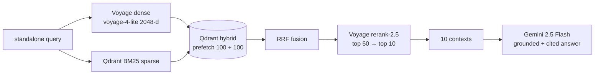
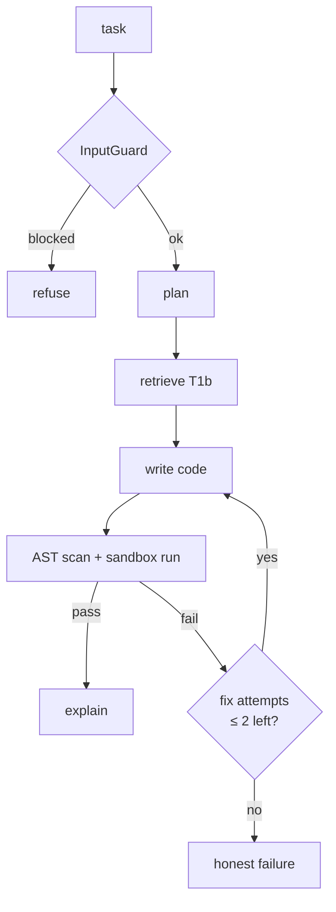
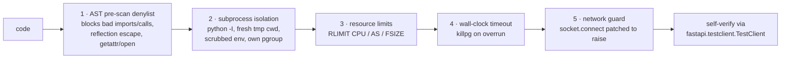

# Component Architecture

> The building blocks under `app/` and how they collaborate. Routes that call these live
> in [[endpoint-summary]]; the conventions they follow are in [[coding-conventions]].

The backend is organized into four layers under `app/`:

- **`services/`** — the RAG runtime (pipeline, cache, memory, router).
- **`components/`** — Haystack-compatible retrieval pieces (hybrid retriever, reranker).
- **`augmentations/`** — the Week-6 add-ons (agent, sandbox executor, security, rate limit).
- **`prompts/`** — prompt templates + Opik registry (no logic, no heavy imports).

Plus cross-cutting modules: `config.py` (settings), `observability.py` (Opik shim),
`dogfood.py` (usage log), `formatting.py`, `redis_client.py`, `logging_config.py`, `models.py`.

## Services (`app/services/`)

### RAG pipeline — `rag_pipeline.py`
The production **T1b** pipeline, split into `retrieve()` and `generate()` so the API can
overlap retrieval with classification and stream generation independently.

- Reuses the cache lookup's dense embedding so retrieval never re-embeds the same query.
- `generate_stream()` returns an `asyncio.Queue` of tokens for SSE; a background producer
  task is cancelled if the client disconnects.
- Falls back to `gemini-2.5-flash-lite` on the primary model's failure (`fallback_used`).
- `is_healthy()` gates `/health` and the `/fix` endpoint.

### Semantic cache — `semantic_cache.py`
Redis **HNSW vector search** for sub-50 ms answers to repeated/paraphrased queries. Returns
`(hit_or_None, embedding)` so the embedding computed for the lookup is reused downstream.
Tuned conservatively (`cache_distance_threshold = 0.16`) to favour **zero wrong-answer
serving** over hit-rate — the paraphrase/near-miss bands overlap (see [[feature-coverage]]
→ *Honest limitations*).

### Conversation memory — `conversation.py`
Redis **sliding window** (last 10 turns) keyed by session, plus **conditional query
rewriting**: a follow-up like *"can it be an integer?"* is rewritten to a standalone query
*"Can a query parameter with a default value be an integer?"* before retrieval. Refusals are
deliberately **not** stored, so the next genuine question isn't mis-treated as a follow-up.

### Query router — `query_router.py`
Classifies each query (`FACTUAL` / `HOW_TO` / `CODE_GENERATION` / …) and builds a
**type-specific prompt** from the retrieved contexts. Classification and retrieval run
concurrently because both depend only on the standalone query.

## Components (`app/components/`)

| Component | Role |
|---|---|
| `qdrant_hybrid_retriever.py` | Hybrid retrieval via Qdrant's native API with explicit dense/sparse prefetch limits, RRF fusion. |
| `voyage_reranker.py` | Haystack-compatible wrapper around Voyage `rerank-2.5`. |

## Augmentations (`app/augmentations/`)

### Agent orchestrator — `agent_orchestrator.py`
A **deterministic, code-driven loop** (not free-form tool calling), mirroring the class
CRAG routing philosophy. Each step is yielded as an SSE event so the UI timeline updates live.

Framework-light and fully unit-testable: inject a fake `pipeline` + fake `executor`.

### Sandboxed code executor — `code_executor.py`
The one net-new piece with no class equivalent. Runs agent/user FastAPI code behind
**layered defenses**:

> **Honest boundary:** this is *defense-in-depth in-process*, not a hard guarantee — the
> common reflection escapes are closed and the blast radius is capped (no secrets, no
> network), but a Docker backend (`--network none --memory 256m`) is the documented
> production path, deferred only because Railway offers no docker-in-docker. See
> [[feature-coverage]].

### Security + rate limit
- `security.py` — `InputGuard` (regex prompt-injection detector, deliberately narrow to
  avoid false refusals) and `OutputValidator` (PII redaction). Deterministic, stdlib-only.
- `rate_limit.py` — per-session Playground limiter (3 runs/min), Redis-backed with an
  in-memory fallback.

## Prompts (`app/prompts/`)
- `templates.py` — prompt text only (single source of truth; line-length lint disabled here).
- `registry.py` — **Opik prompt registry** for versioning + hot-swap; `register_prompts()`
  runs at startup and is a no-op without Opik credentials.

## Cross-cutting modules

| Module | Responsibility |
|---|---|
| `config.py` | `pydantic-settings`; all secrets default to `""` so the app imports without creds (keeps CI hermetic). `get_settings()` is `lru_cache`d. |
| `observability.py` | Opik shim — `@track` spans, thread/trace IDs, feedback logging; degrades to no-ops without Opik. |
| `dogfood.py` | Append-only JSONL usage log at repo-root `dogfood/` (git-ignored); best-effort, never raises into a request. |
| `redis_client.py` | One place to build a Redis client from settings. |
| `formatting.py` | Source-label + presentation helpers shared by API and prompt builder. |
| `models.py` | Pydantic request/response schemas — the contract shared with the frontend SSE parser. |

## Resilience model
Every service getter (`get_rag_pipeline()`, `get_semantic_cache()`, …) **degrades
internally and never raises** at construction. The lifespan builds them all, and `/health`
aggregates each component's `is_healthy()` into `healthy` / `degraded`. Blocking service I/O
(Redis, Voyage embed) is offloaded with `asyncio.to_thread` so a slow dependency can't stall
the event loop. See the request handlers in [[endpoint-summary]].
