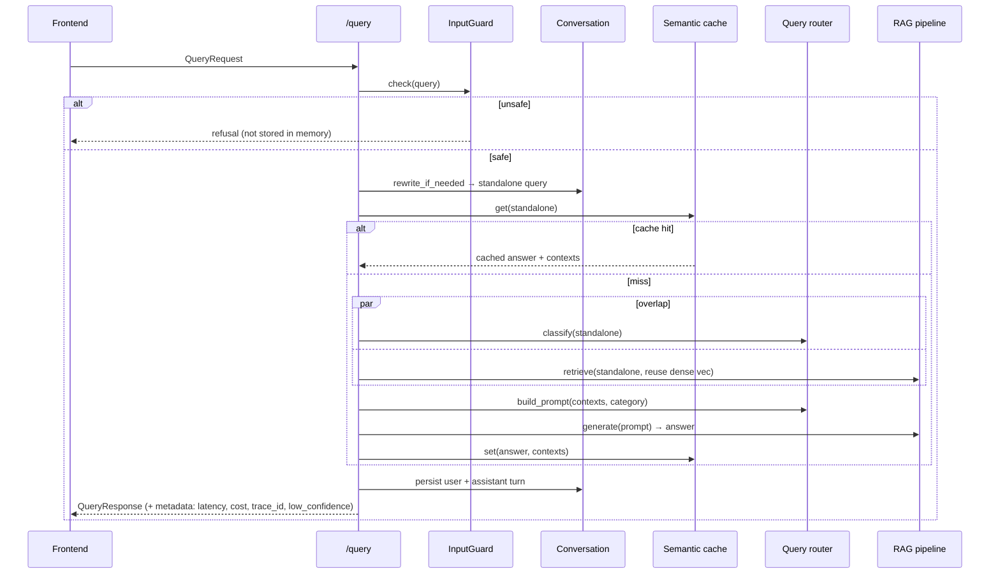

# Endpoint Summary

> The backend's HTTP surface, request/response shapes, and data flow. The authoritative,
> machine-readable contract is `raw/openapi.json` (do not edit — see [[raw/README]]). The
> services behind these routes are in [[component-architecture]].

Backend: **FastAPI**, built via `create_app()` (app-factory so tests get isolated
instances). Base URL defaults to `http://localhost:8000`; the frontend reaches it via
`API_BASE_URL`.

## Routes

| Method | Path | Tag | Purpose |
|---|---|---|---|
| `POST` | `/query` | RAG | One-shot question → cited answer (JSON). |
| `POST` | `/query/stream` | RAG | Same pipeline, streamed as **SSE**. |
| `POST` | `/agent/stream` | Agent | Run the code-runner agent; streams the timeline as SSE. |
| `POST` | `/execute` | Playground | Run user code in the sandbox → `ExecuteResult`. |
| `POST` | `/fix` | Playground | LLM-fix broken code from its traceback → `FixResponse`. |
| `POST` | `/feedback` | Feedback | Store 👍/👎 + comment; logs an Opik feedback score. |
| `GET` | `/conversation/{session_id}` | Conversation | Fetch a session's message history. |
| `GET` | `/health` | Monitoring | Component health (`healthy` / `degraded`). |
| `GET` | `/metrics` | Monitoring | Request count, avg latency, cost, cache stats. |
| `GET` | `/` | General | Service banner + endpoint list. |

## Core schemas (`app/models.py`)

```
QueryRequest   { query: str(1..2000), session_id?: str, use_cache: bool = true }
QueryResponse  { answer, contexts: ContextItem[], metadata, session_id, msg_id }
ContextItem    { rank, score, content, metadata }
AgentRequest   { task: str(1..2000), session_id? }
ExecuteRequest { code: str(1..100000), session_id }
ExecuteResult  { ok, exit_code, stdout, stderr, duration_ms, guard? }
FixRequest     { code, stderr, session_id }   FixResponse { fixed_code, guard? }
FeedbackRequest{ session_id, msg_id, rating, query, answer, comment, metadata }
HealthResponse { status, components }          MetricsResponse { total_requests, avg_latency_ms, total_cost_usd, cache_stats }
```

`models.py` is the **single source of truth** shared by the backend and the frontend SSE
parser — there is a contract round-trip test guarding it (see [[testing-strategy]]).

## Data flow — `POST /query` (non-streaming)



Notes:
- Blocking calls (cache, memory, prompt build) are run via `asyncio.to_thread`; retrieval +
  classification are overlapped with `asyncio.gather`.
- Response `metadata` includes `cache_hit`, `latency_ms`, `cost_usd`, `query_type`,
  `is_follow_up`, `standalone_query`, `trace_id`, and a **retrieval-confidence guard**
  (`top_retrieval_score`, `low_confidence`) — a latency-free slice of CRAG that warns when
  the best reranked chunk scores below `retrieval_confidence_min` (0.3).
- Failures raise `503` (the global handler returns `500` for anything unhandled); internals
  are hidden unless `debug`.

## SSE contract — `/query/stream`

Event order (consumed by `frontend/api_client.py`):

```
session → (rewrite?) → cache_status → classification → context × k → token × N → done
refusal path:  token × N → done{refused}
failure path:  error → done{error}
```

Each event is `event: <name>\ndata: <json>\n\n`. Cache hits are **simulated-streamed**
word-by-word so the UX matches a live generation. If the client disconnects mid-stream the
background generator task is cancelled (no orphaned Gemini calls).

## SSE contract — `/agent/stream`
Streams the agent timeline events: `session → plan → retrieve → write → run → (fix → run)* →
token × N → done{success}`. On error it always closes with a terminal `done{success:false}`
so the UI spinner fails cleanly instead of hanging.

## Playground endpoints
- `/execute` — guards in order: `playground_enabled` (else `404`) → oversize (>10 KB soft
  cap) → per-session rate limit (3/min) → sandbox denylist. Returns a `guard` reason rather
  than a 5xx for expected rejections.
- `/fix` — requires a healthy pipeline (`503` otherwise); prompts the LLM with the code +
  traceback and returns extracted code.

## Monitoring
- `/health` → `{status, components{rag_pipeline, semantic_cache, conversation}}`.
- `/metrics` → counters tracked on `app.state` (requests, latency sum, cost sum) + live
  cache stats. Validated to reconcile under concurrent load (see [[feature-coverage]]).
