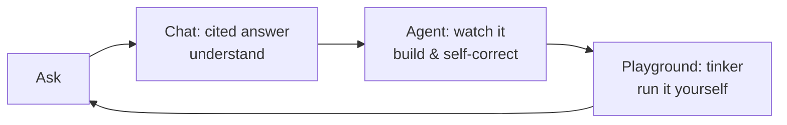

# Onboarding — read me first

> An article for two readers: a **new engineer** picking up FastPilot, and **future-you**
> coming back after months away. It explains what this project *is*, the mental model behind
> it, and how to become productive fast. For the reference detail, follow the [[links]].

## In one paragraph

FastPilot is a **production RAG system** that teaches FastAPI by closing the loop from
reading to running. You ask a question; it answers with citations from a curated FastAPI
corpus (**Chat**); you can watch an agent write, run, and debug working code in a sandbox
(**Agent**); and you can edit that code and run it yourself (**Playground**). It's a real
service — FastAPI backend, Streamlit frontend, Qdrant + Voyage + Gemini + Redis + Opik —
not a notebook demo. Everything is evidence-backed and measured; see [[overview]].

## The mental model

Three ideas explain almost every design decision in the repo:

1. **A learning loop, not a chatbot.** *Understand → Watch → Practice.* Each mode is a stage
   of that loop, and they share one backend. If you're unsure where a feature belongs, ask
   which stage it serves.

2. **Evidence over defaults.** Nothing is "the obvious choice." The retrieval pipeline (T1b)
   won a pairwise bake-off; the cache threshold was calibrated; the slower two-stage router
   was measured *and rejected*. When you change a knob, the bar is to measure it the same way
   (`scripts/05`–`12`, results in `evaluations/`). See [[feature-coverage]].

3. **Degrade, don't crash.** Every external dependency can be missing or down and the app
   still starts; `/health` tells the truth. This is why service getters never raise and why
   secrets default to empty strings (which also keeps CI hermetic). See
   [[component-architecture]] → *Resilience* and [[coding-conventions]].

## How a request actually flows

For `POST /query`: a prompt-injection **guard** runs, a **follow-up rewrite** turns
*"can it be an integer?"* into a standalone question, the **semantic cache** is checked, and
on a miss the system **classifies and retrieves in parallel**, builds a type-specific prompt,
**generates** with Gemini, caches the answer, and persists the turn. The streaming endpoint
emits the same pipeline as Server-Sent Events. The full sequence diagram is in
[[endpoint-summary]].



## Get productive in ~15 minutes

```bash
# 1. Install (Python 3.11–3.13 + uv)
uv sync --extra dev

# 2. Run the hermetic test suite — no keys needed, proves your setup
uv run pytest            # ~210 tests, < 10s

# 3. (optional) Run the app locally — needs real keys in .env
cp .env.example .env     # fill in Qdrant / Voyage / Gemini / Redis / Opik
uv run uvicorn app.main:app --port 8000 --reload     # backend → /docs
cd frontend && uv run streamlit run app.py           # frontend → :8501
```

You don't need credentials to develop most of the backend — the tests run fully offline.
You only need keys to talk to live services. See [[testing-strategy]].

## Where things live (and where to start reading)

| If you want to… | Start at | Then |
|---|---|---|
| Understand the whole system | [[overview]] | [[component-architecture]] |
| Change or add an endpoint | [[endpoint-summary]] | `raw/openapi.json` |
| Touch retrieval / generation | [[component-architecture]] → *RAG pipeline* | `docs/retrieval-strategy.md` |
| Work on the agent or sandbox | [[component-architecture]] → *Augmentations* | `app/augmentations/` |
| Write code or tests | [[coding-conventions]] | [[testing-strategy]] |
| Know what's done vs left | [[feature-coverage]] | [[log]] |

## A few things that will surprise you

- **The sandbox is in-process defense-in-depth, not a VM.** It blocks the textbook escapes
  and removes secrets + network, but the honest production path is a Docker backend. This is
  documented openly, not hidden — see [[component-architecture]] and [[feature-coverage]].
- **Refusals aren't stored in conversation memory** — otherwise the next real question gets
  mis-rewritten as a follow-up. Small decision, real bug avoided.
- **The cache simulates streaming on a hit** so a cached answer *feels* the same as a live one.
- **`docs/` ≠ `wiki/`.** `docs/` holds the original design-decision essays (chunking, retrieval,
  production, evaluation); `wiki/` is the living developer map that points at them. Don't
  duplicate — link.

## Keeping this wiki useful
This wiki is meant to stay current. The maintenance rules (when to update which page) are in
the repo's [[CLAUDE.md]]; the short version is: **after real work, update the relevant page,
refresh [[index]], and append to [[log]].**

## The honest state of the project
Code, docs, evals, tests, CI, and deploy config are **done and green**. The two remaining
steps are owner-only and browser-bound: **deploy to Railway** and **record a demo**, then
fill the placeholders in `README.md`. Those turn "great code" into "a product you can click."
Tracked in [[feature-coverage]].
