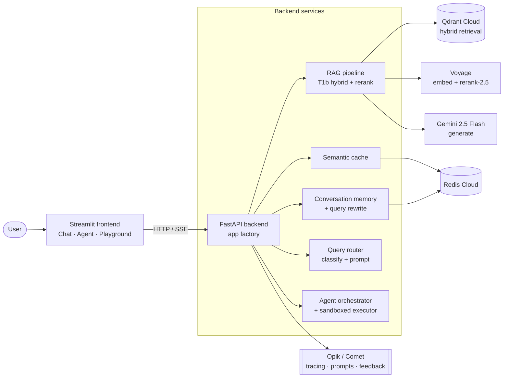

# Overview

> High-level map of FastPilot: what it is, why it exists, the tech stack, and how the
> pieces fit. For the deep dives, follow the cross-links to [[component-architecture]],
> [[endpoint-summary]], and [[feature-coverage]].

## What it is

**FastPilot** is a production **RAG (Retrieval-Augmented Generation)** system that doubles
as a learning companion for [FastAPI](https://fastapi.tiangolo.com/). Its tagline —
*"Learn FastAPI, fast."* — describes a loop that closes the gap between reading and running:

| Mode | Verb | What it does |
|---|---|---|
| 💬 **Chat** | *understand* | Cited answers grounded in the FastAPI corpus; every claim carries a `[n]` source. |
| ▶️ **Agent** | *watch* | Writes, runs, and **self-corrects** real code in a sandbox; the user watches it debug. |
| 🧪 **Playground** | *practice* | The user edits the agent's code and re-runs it in the same sandbox. |

## Why it exists (the problem)

FastAPI knowledge is **fragmented and unverified**: it lives across the official docs,
example repos (the full-stack template), and GitHub issues/discussions — and *reading*
docs doesn't prove understanding. The only way to verify understanding is to run code,
which means leaving the docs. FastPilot pulls retrieval + generation + a code sandbox into
one loop so a learner can ask, watch working code get produced, and then tinker. Full
framing in `docs/scoping.md`.

## Tech stack

| Layer | Choice | Notes |
|---|---|---|
| Frontend | **Streamlit** | Three views (Chat / Agent / Playground); pure-Python SSE client. |
| Backend | **FastAPI** | App-factory pattern; SSE streaming; graceful degradation. |
| Vector DB | **Qdrant Cloud** | Hybrid (dense + sparse/BM25) retrieval with native prefetch. |
| Embeddings + rerank | **Voyage AI** | `voyage-4-lite` (2048-d dense) + `rerank-2.5`. |
| Generation | **Google Gemini** | `gemini-2.5-flash` (+ `-flash-lite` fallback). |
| Memory + cache | **Redis Cloud** | Conversation sliding window + HNSW semantic cache (RediSearch). |
| Observability | **Opik / Comet** | Tracing, prompt versioning, feedback scores, online-eval rule. |
| Packaging / deploy | **uv · Docker · Railway** | Two-service topology; see `DEPLOY.md`. |

## System architecture



State is **external** (Qdrant + Redis are managed cloud services); nothing stateful runs in
a Railway container, so both services scale and restart cleanly. Each backend service
**degrades internally** — missing credentials or a downed Redis don't crash startup;
`/health` reports the truth instead (see [[component-architecture]] → *Resilience*).

## Request flow at a glance

`POST /query`:
`InputGuard → rewrite-if-follow-up → semantic-cache lookup → (on miss) classify ∥ retrieve
→ build prompt → generate → cache → persist turn → dogfood-log → respond`.
The streaming variant (`/query/stream`) emits the same pipeline as Server-Sent Events.
Detailed sequence in [[endpoint-summary]].

## Repository layout

```
app/            FastAPI backend (services/, components/, augmentations/, prompts/)
frontend/       Streamlit app (chat + agent_view + playground_view + api_client)
scripts/        Operational + eval scripts (verify env, reindex, run evals, soak tests)
tests/          210 tests (hermetic by default; integration/live/visual markers)
docs/           Design decision docs (chunking, retrieval, production, augmentation, eval)
evaluations/    Eval results (evidence) + dogfood log
wiki/           This developer wiki
```

## Where to go next
- New here? Read [[onboarding]].
- Building a feature? [[component-architecture]] + [[coding-conventions]].
- Touching the API? [[endpoint-summary]] (+ the contract in `raw/openapi.json`).
- Adding/changing tests? [[testing-strategy]].
- What's done vs deferred? [[feature-coverage]].
